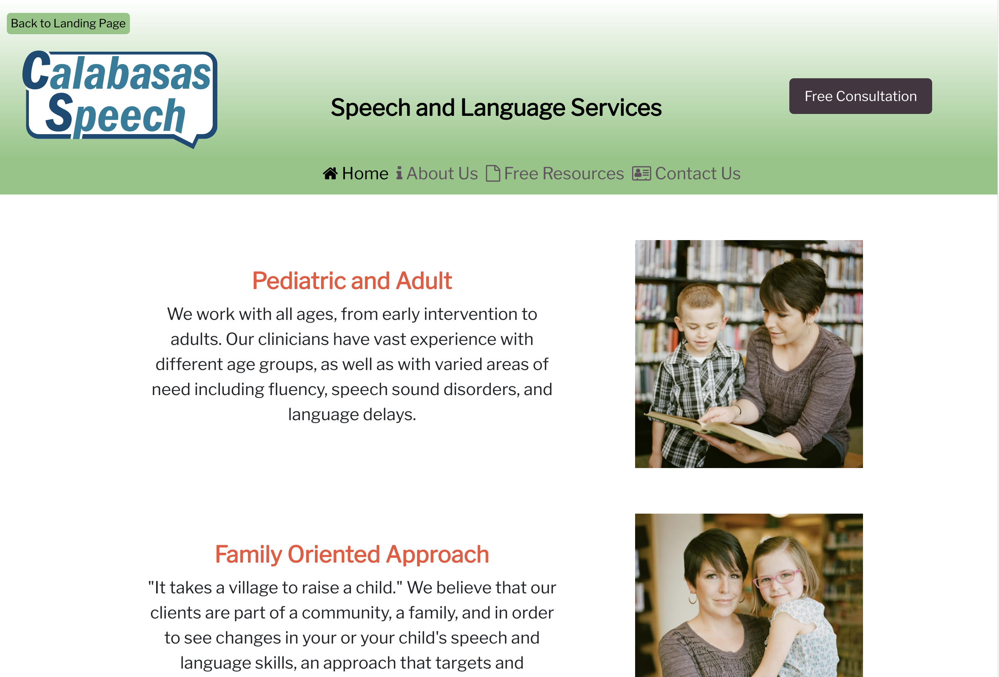
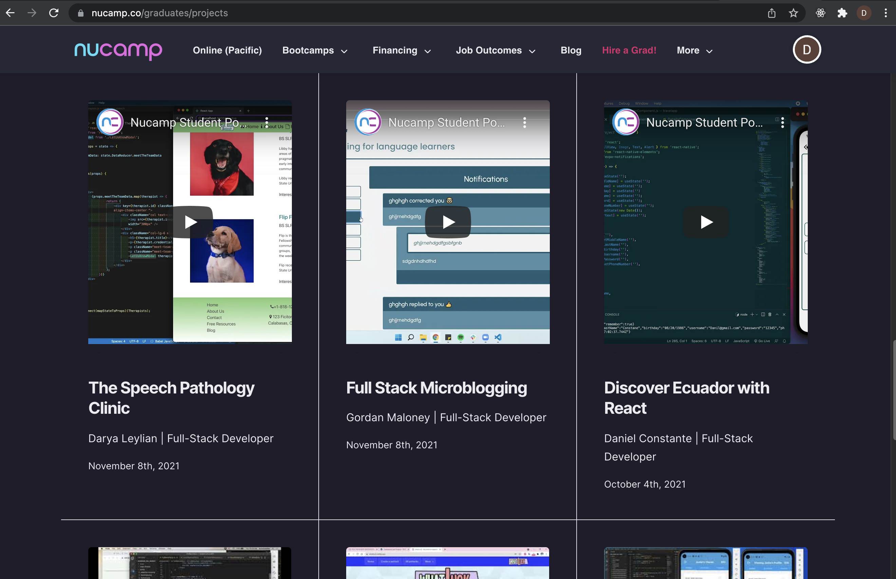
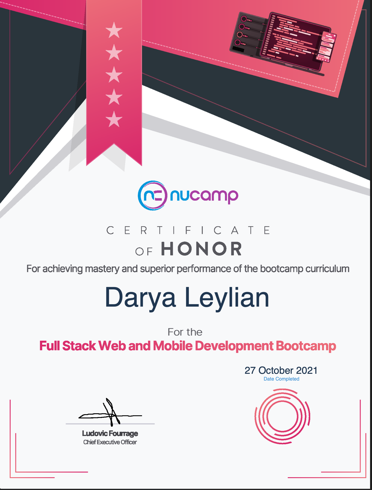

# Calabasas Speech

https://cs-info.vercel.app/

Author: Darya Leylian

Github: https://github.com/dsleylian

## About this Project 

Calabasas Speech is a website for a made-up speech and language clinic. The website includes information about the clinic's approach to speech and language therapy, their staff and their specialties, as well as some free resources. I am a licensed Speech Language Pathologist, and therefore, the content and information in the Free Resources page is accurate - feel free to read through and use it! 




## Development:

This web app was made using:
- React
- Javascript
- HTML
- CSS

## Install Instructions

Clone the project locally. First, install all dependencies with
```
npm install
````
Then, to run locally:
```
npm start
```

## Nucamp Bootcamp 

This project was submitted as my graduation project at Nucamp Coding Bootcamp, and was featured in the graduation ceremony.  



